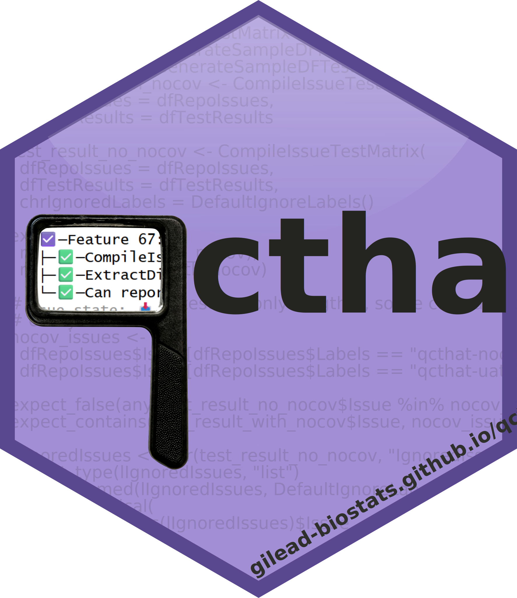

<!-- README.md is generated from README.Rmd. Please edit that file -->

```{r, include = FALSE}
knitr::opts_chunk$set(
  collapse = TRUE,
  comment = "#>",
  fig.path = "man/figures/README-",
  out.width = "100%"
)
```

# qcthat <a href="https://gilead-biostats.github.io/qcthat/"></a>

<!-- badges: start -->

<div class="pkgdown-release">

[](https://github.com/Gilead-BioStats/qcthat/actions/workflows/R-CMD-check.yaml)
[](https://github.com/Gilead-BioStats/qcthat/actions/workflows/test-coverage.yaml)
[](https://github.com/Gilead-BioStats/qcthat/actions/workflows/pkgdown-all.yaml)

</div>

<div class="pkgdown-devel">

[](https://github.com/Gilead-BioStats/qcthat/actions/workflows/R-CMD-check.yaml)
[](https://github.com/Gilead-BioStats/qcthat/actions/workflows/test-coverage.yaml)
[](https://github.com/Gilead-BioStats/qcthat/actions/workflows/pkgdown-all.yaml)

</div>

<!-- badges: end -->

`{qcthat}` is a quality control framework for R packages. It has been developed for use in the `gsm` family of packages, such as [`gsm.core`](https://github.com/Gilead-BioStats/gsm.core).

The goal of `{qcthat}` is to produce qualification reports linking GitHub issues to evidence that those issues have been implemented. These reports can be used as part of a quality control and acceptance process for R packages, particularly those used in regulated environments such as clinical trials.

## ⚙️ Installation

You can install the latest release of qcthat from [GitHub](https://github.com/) with:

``` r
# install.packages("pak")
pak::pak("Gilead-BioStats/qcthat@*release")
```

<div class="pkgdown-devel">

You can install the development version of qcthat from
[GitHub](https://github.com/) with:

``` r
# install.packages("pak")
pak::pak("Gilead-BioStats/qcthat")
```

</div>

Learn more in `vignette("qcthat")`.

## 📋 Example Report Process

`Action_qcthat()` installs a GitHub action to generate QC reports. At its core, it uses the functions `QCPackage()`, `QCPR()`, `QCCompletedIssues()`, and `QCMilestones()` to generate a report like this:

<details><summary>✅ A qcthat issue test matrix with 1 milestone, 19 issues, and 59 tests</summary>

```
└─█─Milestone: v1.0.0 (19 issues, 59 tests)
  ├─☑️─Technical Task 101: Switch `lglShowIgnoredLabels` default to TRUE
  │ └─✅─Ignored issues are shown by default (#101)
  ├─☑️─Feature 80: Filter main qcthat report to only "closed (completed)"
  │ └─✅─QCCompletedIssues filters to completed issues (#80, #69)
  ├─☑️─Bug 77: GHA-generated report stability
  │ └─✅─Reports generated via GHA include information about the issues (#77, #37)
  ├─☑️─Feature 73: Add qcthis.yaml to a package
  │ ├─✅─InstallAction calls InstallFile with expected parts (#73)
  │ ├─✅─Action_qcthat targets the expected action (#55, #68, #69, #73, #88, #141, #157, #198)
  │ ├─✅─qcthatPath constructs paths (#73)
  │ └─✅─InstallFile copies files as expected (#73)
  ├─☑️─Technical Task 72: Add qc report to triggering PR as comment
  │ └─✅─CommentReport generates the expected call (#99, #72)
  ├─☑️─Requirement 69: Package QC Report Usability
  │ ├─✅─Action_qcthat targets the expected action (#55, #68, #69, #73, #88, #141, #157, #198)
  │ ├─✅─Can print without milestone info (#40, #69)
  │ ├─✅─QCPackage wraps the core qcthat functions (#46, #69)
  │ └─✅─QCCompletedIssues filters to completed issues (#80, #69)
  ├─☑️─Requirement 68: PR/Branch Report
  │ ├─✅─Action_qcthat targets the expected action (#55, #68, #69, #73, #88, #141, #157, #198)
  │ ├─✅─QCMergeGH filters to merge-associated issues (#68, #84)
  │ ├─✅─QCMergeLocal filters to ref-specific issues (#68, #84)
  │ ├─✅─QCPR filters to PR-related issues (#68, #84)
  │ └─✅─QCMilestones reports on specific milestones (#88, #68)
  ├─☑️─Feature 67: Ignore issues with `qcthat-nocov` label
  │ ├─✅─CompileIssueTestMatrix excludes issues in chrIgnoredLabels (#67)
  │ ├─✅─ExtractDisposition() helper counts test errors as failures (#67)
  │ └─✅─Can report ignored issue counts (#67, #81)
  ├─☑️─Feature 55: GHA: Report of associated issues
  │ └─✅─Action_qcthat targets the expected action (#55, #68, #69, #73, #88, #141, #157, #198)
  ├─☑️─Feature 46: Wrapper to run everything
  │ └─✅─QCPackage wraps the core qcthat functions (#46, #69)
  ├─☑️─Feature 40: Print Without Milestones
  │ └─✅─Can print without milestone info (#40, #69)
  ├─☑️─Bug 96: Don't include ignored labels in `QCIssues()` warnings
  │ └─✅─QCIssues doesn't warn about ignored issues (#96)
  ├─☑️─Bug 95: Install qcthat as part of Action installation
  │ └─✅─qcthat is installed as part of the GHA (#95)
  ├─☑️─Feature 90: Function to create qcthat-nocov label
  │ ├─✅─CreateGHLabel reports success conditional on lglVerbose (#90)
  │ ├─✅─CreateGHLabel throws an error if the API doesn't report the expected result (#90)
  │ ├─✅─CreateGHLabel attempts to update existing label (#90)
  │ ├─✅─MaybeUpdateGHLabel decides based on lglUpdate (#90)
  │ ├─✅─UpdateGHLabel makes the expected call (#90)
  │ ├─✅─UpdateGHLabel throws an error if the API doesn't report the expected result (#90)
  │ ├─✅─EmptyLabelsDF returns the expected structure (#90)
  │ ├─✅─EnframeGHLabels returns NULL for empty list (#90)
  │ ├─✅─EnframeGHLabels converts raw labels to data frame (#90)
  │ ├─✅─EnframeGHLabels adds hash to color codes (#90)
  │ ├─✅─FetchGHLabelsRaw calls the correct API endpoint (#90)
  │ ├─✅─FetchGHLabels returns empty data frame when no labels exist (#90)
  │ ├─✅─FetchGHLabels returns data frame with labels (#90)
  │ ├─✅─Default helpers return expected values (#90)
  │ ├─✅─SetupGHLabels creates missing labels (#90)
  │ ├─✅─PrepareDFLabels normalizes correctly (#90)
  │ ├─✅─Helper functions normalize strings correctly (#90)
  │ └─✅─ValidateDFLabels checks for required columns (#90)
  ├─☑️─Feature 88: Report by Milestone
  │ ├─✅─Action_qcthat targets the expected action (#55, #68, #69, #73, #88, #141, #157, #198)
  │ ├─✅─QCMilestones reports on specific milestones (#88, #68)
  │ ├─✅─QCMilestones warns about unknown milestones (#88)
  │ └─✅─QCMilestones errors with no valid milestones (#88)
  ├─☑️─Feature 86: Function to report on specific issues
  │ ├─✅─QCIssues reports on specific issues (#86)
  │ ├─✅─QCIssues warns about unknown issues (#86)
  │ └─✅─QCIssues errors with no valid issues (#86)
  ├─☑️─Feature 85: Report Issue-Test Coverage in Footer
  │ ├─✅─Printing an IssueTestMatrix outputs a user-friendly tree (#31, #36, #60, #85)
  │ └─✅─MakeITRCoverageFooter deals with all cases (#85)
  ├─☑️─Feature 84: Function(s) to filter report to issues associated with PR/branch
  │ ├─✅─FetchMergeCommitSHAs returns unique, sorted SHAs (#84, #133)
  │ ├─✅─FetchAllMergePRNumbers returns unique, sorted PR numbers (#84)
  │ ├─✅─FetchAllMergePRNumbers returns empty vector for no matching PRs (#84)
  │ ├─✅─FetchPRRefs returns source and target refs (#84, #133, #149)
  │ ├─✅─FetchRepoPRs returns an empty df when no issues found (#84)
  │ ├─✅─FetchRepoPRs returns a formatted df for real PRs (#84)
  │ ├─✅─GuessPRNumber delegates to its sub-functions (#84)
  │ ├─✅─GetGHAPRNumber returns NULL for bad arg (#84, #163)
  │ ├─✅─GetGHAPRNumber extracts PR number from lGHEventPayload when available (#84, #163)
  │ ├─✅─GetGHAPRNumber returns NULL for bad extracted PR number (#84, #163)
  │ ├─✅─FetchRefPRNumber fetches PR number for a branch (#84, #132)
  │ ├─✅─QCMergeGH filters to merge-associated issues (#68, #84)
  │ ├─✅─QCMergeLocal filters to ref-specific issues (#68, #84)
  │ ├─✅─FindKeywordIssues extracts issues that will be closed by commits (#84)
  │ ├─✅─QCPR errors informatively for bad intPRNumber (#84)
  │ ├─✅─QCPR filters to PR-related issues (#68, #84)
  │ ├─✅─PrepareGQLQuery constructs a query (#84)
  │ └─✅─GQLWrapper wraps a query correctly (#84)
  └─☑️─Requirement 81: Report issue test coverage
    └─✅─Can report ignored issue counts (#67, #81)
# Issue state: 📥 = open, ☑️ = closed (completed), ⛔ = closed (won't fix)
# Test disposition: ✅ = passed, ❌ = failed, 🚫 = skipped
```
</details>
✅ All tests passed

🟢 All issues have at least one test

🙈 2 issues with label "qcthat-nocov" were ignored

## 🙋 Contributing

Contributions are welcome! Creating a utility package that is generalizable and extensible to all sorts of repository structures is challenging, and your input is greatly appreciated.

Before submitting a pull request, make sure to file an [issue](https://github.com/Gilead-BioStats/qcthat/issues), which should generally fall under one of the following categories:

-   Bugfix: something is broken.
-   Feature: something is wanted or needed.
-   QC: documentation or metadata is incorrect or missing.

New code should generally follow the [tidyverse style guide](https://style.tidyverse.org/).

### Code of Conduct

Please note that the `{qcthat}` project is released with a [Contributor Code of Conduct](https://gilead-biostats.github.io/qcthat/CODE_OF_CONDUCT.html). By contributing to this project, you agree to abide by its terms.

