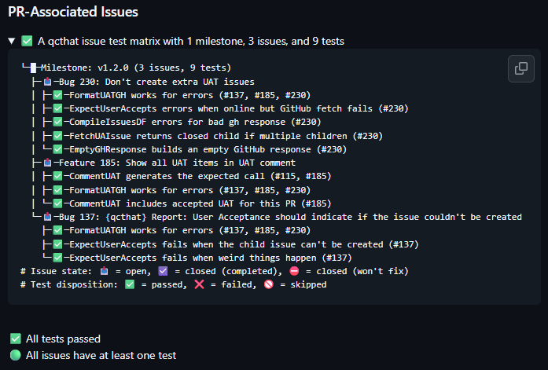
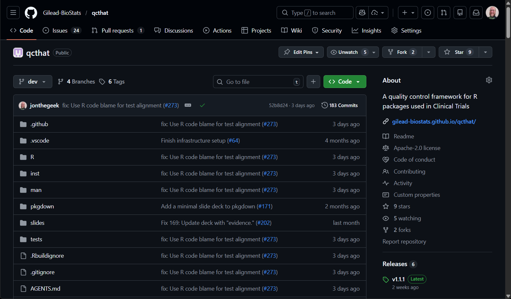
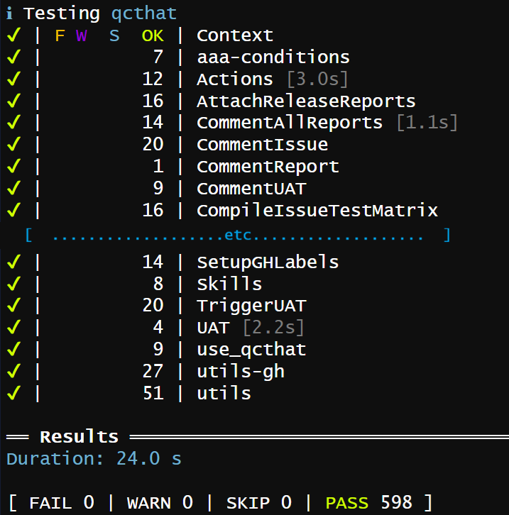
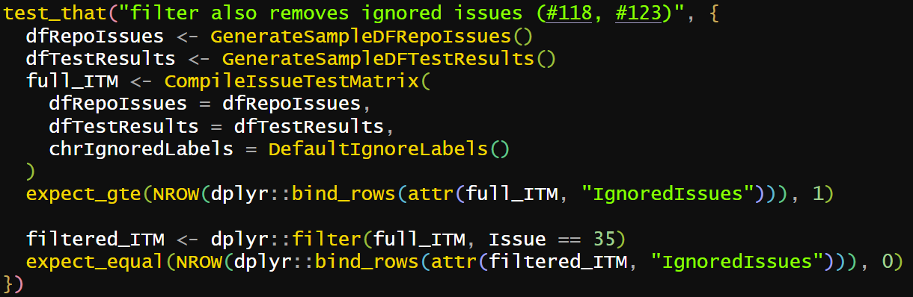
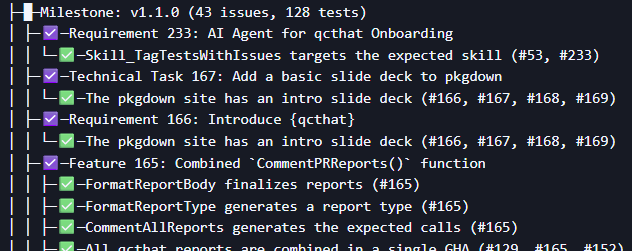
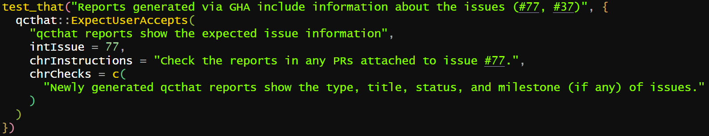
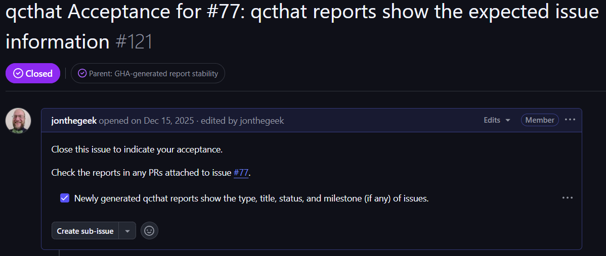

## `{qcthat}` generates qualification reports from your test suite

:::: columns

::: {.column width="60%"}

{width=100%}

:::

::: {.column width="40%"}

[{width=100%}](https://github.com/Gilead-BioStats/qcthat/releases/latest)

:::

::::

::: notes
- We'll talk a bit later about all the reports that are available right now, including Milestones and UAT which aren't shown in this screenshot.
- The QR code takes you to the latest release. Scroll down to see its attached reports.
:::

# R package qualification is necessary but challenging

## Regulators require evidence that software performs as intended

- FDA (etc) require documented proof that software produces reliable results
- Adopting organization often takes on burden of proof

::: notes
- Atorus OpenVal for a collection of validated packages.
- This process can slow or prevent R adoption.
:::

## R packages might do what you need, but you'll need proof

:::: columns

::: {.column width="60%"}

{width=100%}

:::

::: {.column width="40%"}

- Many R packages are developed on [GitHub](https://github.com)
- Lots of information here, but not clear how it connects

:::

::::

::: notes
- Talk about GitHub
:::

## Qualification is often a manual, retrospective burden

- Qualification documents often created *after* development
- Development team manually maps specifications to functions and evidence
- Repeated for every new release

## "Validation debt" delays releases and increases risk

- Deferred qualification: harder to reconstruct what was tested and why
- Manual qualification docs drift out of sync with code
- Teams avoid using updates to dodge re-qualification

# The standard R package lifecycle generates evidence but lacks traceability

## Modern R packages use `{testthat}` for robust automated testing

- Industry-standard testing framework
- Confirms functions behave as expected *and keep working after changes*
- Activate with `usethis::use_testthat()`

## CI/CD pipelines ensure code integrity on every commit

- GitHub Actions run tests on every push (`usethis::use_github_action()`)
- Failures caught long before code reaches production
- Standard practice for well-maintained R packages

## Standard `{testthat}` scripts provide the evidence of implementation

:::: columns

::: column

- Every test run produces machine-readable results: pass, fail, skip, or warning
- Proves that code *works*

:::

::: column

{width=100%}

:::

::::

## *But:* A passing test suite doesn't prove which requirement was met

- `{testthat}` shows *what was tested*, not *why*
- No built-in link between GitHub issue and its tests
- Reviewers must manually reconstruct the mapping

# `{qcthat}` connects issues to tests for continuous qualification

## Connecting tests to issues is straightforward

- Add `(#123)` or `(#84, #132)` (issue numbers) to `test_that()` description to tag test to issue

{width=100%}

## `{qcthat}` Reports are easy to generate

:::: columns

::: column

- `QCPackage()` generates a full report linking issues to tagged tests
- Organized by milestone; tests nested under linked issues
- Filter to subsets: `QCCompletedIssues()`, `QCPR()`, `QCMilestones()`

:::
::: column

{width=100%}

:::

::::

## The "Issue-Test Matrix" shows the connections between issues and tests

{width=100%}

::: notes
- "Requirement", "Technical Task", and "Feature" are issue types in our GitHub repository.
- If you're reading carefully, these tests sound hard to test.
:::

## User Acceptance Testing (UAT) is integrated directly into tests

- `ExpectUserAccepts()` creates GitHub issues requiring manual sign-off

{width=100%}

## User Acceptance Testing (UAT) is integrated directly into tests

- UAT issues = children of originating requirement issue
- UAT issue closed → test passes

{width=100%}

# `{qcthat}` transforms qualification from a retrospective burden into a seamless byproduct of development

## Automated bots bring qualification reports directly to the Pull Request

- GitHub Action comments on every PR with reports: 
  - PR-Associated Issues
  - Completed Issues
  - Milestone
  - UAT
- Reviewers see qualification status *before* merging
- Reports update automatically as the PR changes

## Immutable artifacts are automatically attached to GitHub Releases

:::: columns

::: {.column width="60%"}

- Completed Issues and Milestone reports embedded in GitHub Release description
- Each release carries its own qualification evidence
- Version-controlled and tamper-evident by design

:::

::: {.column width="40%"}

[{width=100%}](https://github.com/Gilead-BioStats/qcthat/releases/latest)

:::

::::

::: notes
- Link to the GitHub Actions run that generated it, so you can compare results
:::

## Packages are qualified continuously with every change

- Qualification as a byproduct of development, not a separate phase
- Developers tag tests to issues as they're written
- Reports identify untested issues and unlinked tests

# You can add `{qcthat}` to your package today

## Setup takes minutes, not hours

- `pak::pak("Gilead-BioStats/qcthat")`
- `qcthat::use_qcthat()`
- Tag your tests: `test_that("Thing works (#123)", ...)`
- Experimental: `qcthat::Skill_TagTestsWithIssues()`
  - Tell an agent "tag tests with issues"

## Contact us with questions and comments

- `{qcthat}` package website: [gilead-biostats.github.io/qcthat](https://gilead-biostats.github.io/qcthat)
- Submit issues & discuss at [github.com/Gilead-BioStats/qcthat](https://github.com/Gilead-BioStats/qcthat)
- Chat with us after the talk!
